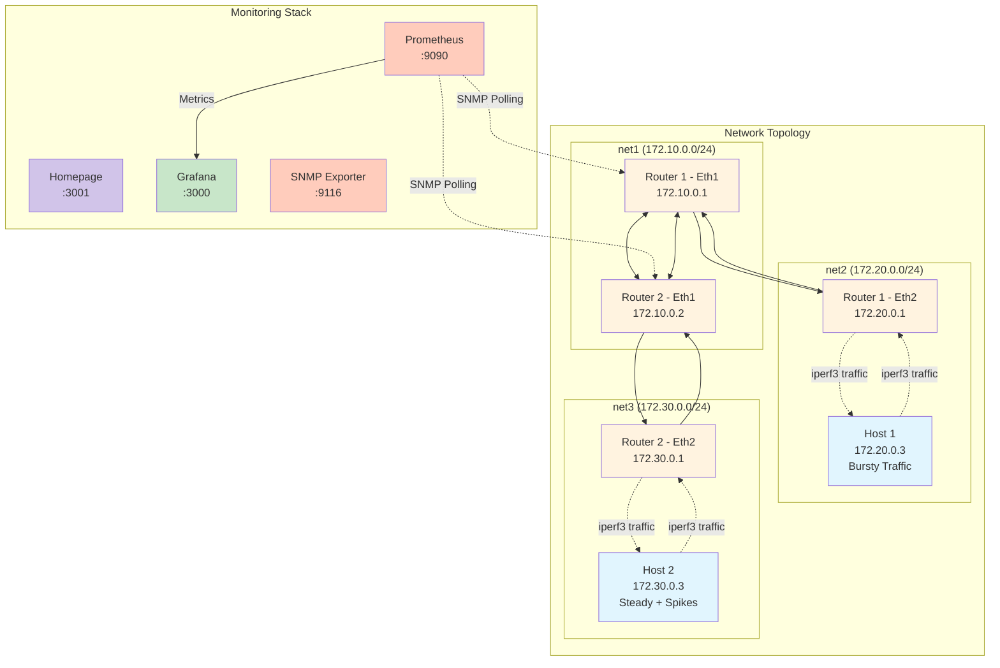

# Network Traffic Pattern Lab

This project creates a network topology with two hosts connected through two Arista cEOS routers. The hosts generate realistic network traffic patterns using iperf3 to demonstrate various traffic behaviors. The lab includes monitoring with Homepage, Grafana, Prometheus, and SNMP Exporter for visualizing the traffic patterns.

## Prerequisites

- Docker installed
- Docker Compose installed
- Arista cEOS image (path specified in `.env` file or as a command line argument)
- No special permissions needed - runs entirely on Docker for Mac

## Environment Setup

The lab uses environment variables to specify the location and version of the Arista cEOS image:

1. Copy the template environment file:
   ```bash
   cp .env.template .env
   ```

2. Edit the `.env` file to set the path to your Arista cEOS image:
   ```
   CEOS_IMAGE_PATH=/path/to/your/cEOS-lab-image.tar
   CEOS_VERSION=4.33.1
   ```

**Note:** The `.env` file is excluded from version control to avoid sharing sensitive or system-specific information.

## Architecture



The topology consists of:
- Two hosts (host1 and host2) running Alpine Linux
- Two routers (router1 and router2) running Arista cEOS
- Four monitoring containers:
  - Grafana for visualization
  - Prometheus for metrics collection
  - SNMP Exporter for network metrics
  - Homepage dashboard for easy access to all services

## Adding Arista Image[^1]
[^1]: This section was borrowed from https://netlab.tools/labs/ceos/
1. Download cEOS from Arista Software Download page (registration/login required)
2. The downloaded file is a xzipped tar file. If it’s saved as .tar file (that’s what Chrome on MacOS does), rename it to .tar.xz file
3. Unzip the file with unxz filename

cEOS tar archive does not contain the container image name (repository and tag); you have to set them when importing the archive into Docker image repository. 

Install the Docker image with docker image import <tar-filename> <tag>, for example docker image import cEOS64-lab-4.31.2F.tar ceos:4.31.2F


## Usage

1. Run the lab using Docker Compose (with the image path from the `.env` file):

```bash
./run-docker.sh
```

Alternatively, specify the image path directly:

```bash
./run-docker.sh /path/to/cEOS-lab-image.tar
```

This will:
- Check if the Arista cEOS image is already loaded, and load it if needed
- Start all containers using Docker Compose
- Start the traffic generation scripts on both hosts using iperf3

2. Monitor the status of the routers and connectivity:

```bash
./monitor.sh
```

This will:
- Check if both routers are running
- Display interfaces and routing tables for both routers
- Test connectivity between hosts
- Show active Docker containers

3. Access Monitoring Dashboards:

- Homepage Dashboard: http://localhost:3001
- Grafana: http://localhost:3000 (Username: admin, Password: admin)
- Prometheus: http://localhost:9090

4. Access Network Devices:

**Arista cEOS Routers:**
- Router 1 SSH: `ssh arista@localhost -p 2201` (password: arista)
- Router 2 SSH: `ssh arista@localhost -p 2202` (password: arista)
- Direct CLI access: `docker exec -it traffic-lab-router1 Cli`

**Alpine Hosts:**
- Host 1 SSH: `ssh root@localhost -p 2221` (password: password)
- Host 2 SSH: `ssh root@localhost -p 2222` (password: password)
- Host 1 iperf3 server: Port 5201
- Host 2 iperf3 server: Port 5202

5. Destroy the lab when done:

```bash
docker compose down
```

## Traffic Generation

The hosts generate realistic network traffic patterns using iperf3:
- **Host1**: Bursty traffic pattern - alternates between high bandwidth bursts (50-100 Mbps for 10-20 seconds) and idle periods, simulating typical user activity like file transfers or video streaming
- **Host2**: Steady baseline with periodic spikes - maintains a constant 10 Mbps baseline with occasional traffic spikes (80-120 Mbps), simulating a server with regular traffic and periodic large transfers

These patterns create realistic network visualizations in the monitoring dashboards, demonstrating common traffic behaviors seen in production networks.

## Monitoring Stack

The monitoring infrastructure includes:
- **Homepage**: Modern dashboard for accessing all services in one place
- **Grafana**: Dashboard visualization tool
- **Prometheus**: Time series database for storing metrics
- **SNMP Exporter**: Collects SNMP metrics from routers

The routers are configured with SNMP to provide interface traffic statistics that are collected by the monitoring stack.

## Files

- `docker-compose.yml` - Docker Compose configuration for all services
- `run-docker.sh` - Script to start the lab
- `monitor.sh` - Script to check router status and connectivity
- `setup-arista.sh` - Script to load the Arista cEOS image and prepare configurations
- `.env.template` - Template for environment variables file
- `.env` - Environment variables file (not included in version control)
- `.gitignore` - Specifies files to exclude from version control
- `scripts/host1.sh` & `scripts/host2.sh` - Traffic generation scripts
- `router1/config/startup-config` - Arista cEOS Router 1 configuration
- `router2/config/startup-config` - Arista cEOS Router 2 configuration
- `monitoring/` - Monitoring configuration files
  - `prometheus/prometheus.yml` - Prometheus configuration
  - `snmp_exporter/snmp.yml` - SNMP Exporter configuration
  - `grafana/provisioning/` - Grafana provisioning configs
  - `grafana/dashboards/` - Grafana dashboards
  - `homepage/config/` - Homepage configuration
    - `settings.yaml` - General settings
    - `services.yaml` - Service definitions
    - `widgets.yaml` - Dashboard widgets
    - `docker.yaml` - Docker integration

## Compatibility

This lab is designed to work on both x86_64 and ARM-based systems. For Apple Silicon and other ARM-based systems, use the Arista cEOS ARM image. For x86_64 systems, use the standard cEOS image. All other containers use multi-architecture images for compatibility across platforms.